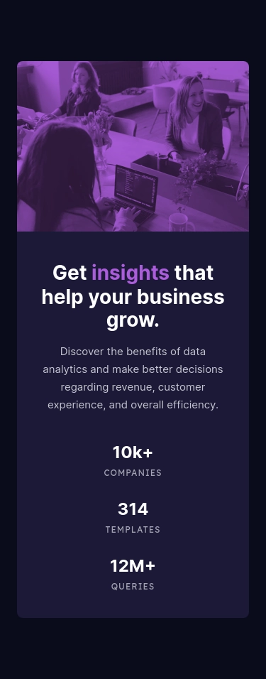

# Frontend Mentor | Stats preview card component
This is my solution to the [Stats preview card component challenge](https://www.frontendmentor.io/challenges/stats-preview-card-component-8JqbgoU62) from [Frontend Mentor](https://www.frontendmentor.io/).

## Tech Stack
 - Angular
 - SCSS

## Developer Tools
 - VS Code
 - Figma

## Links
 - [Website](https://fem-stats-preview-card-component-jgerard.vercel.app) hosted with [Vercel](https://vercel.com/)
 - Images served from [ImageKit](https://imagekit.io/) CDN
 - [Solution]()

## Scrolling screenshots
### Desktop

### Tablet

### Mobile

## About Frontend Mentor
[Frontend Mentor](https://www.frontendmentor.io/) challenges help you improve your coding skills by building realistic projects.

## Copyright
© 2023 Johnny Gérard
